# PacketMaze

# Challenge Details :

## Tools :
-  [Wireshark](https://www.wireshark.org/download.html) 
-  [MAC Address Lookup](https://dnschecker.org/mac-lookup.php)
    
# Challenge Solve :

**Q1** : What is the FTP password?

S1 : filter packet by write (ftp) to show the data traffic then you see in info password (AfricaCTF2021)  

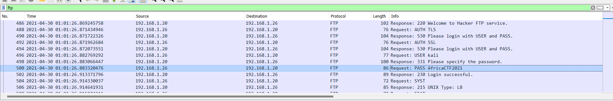

----------------------------------------------------------
**Q2** : What is the IPv6 address of the DNS server used by 192.168.1.26? (####::####:####:####:####)

S2 : show MAC of this ip 192.168.1.26 

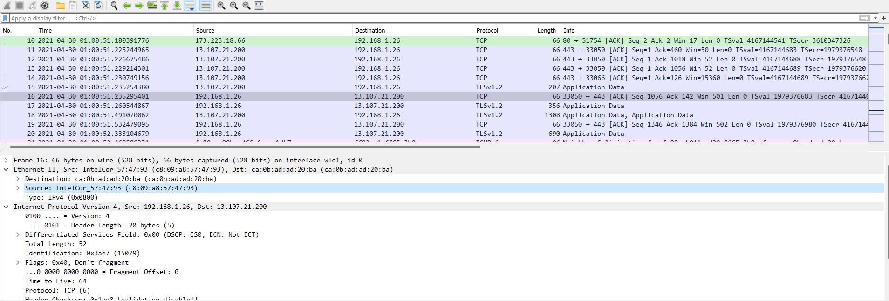

then Write this filter (eth.addr == ca:0b:ad:ad:20:ba && ipv6) IPv6 is in source 

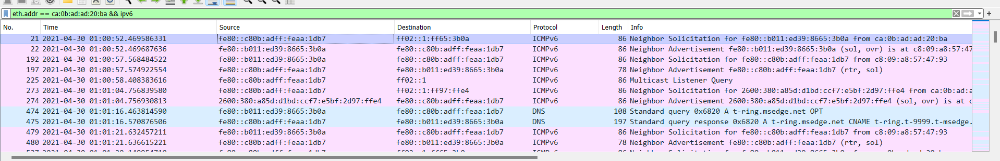

----------------------------------------------------------------------------
**Q3** : What domain is the user looking up in packet 15174?

S3 :  use this filter to get packet 15174 (frame.number == 15174)
then extend Domain name system then Queries , you show domain name is (www.7-zip.org)  

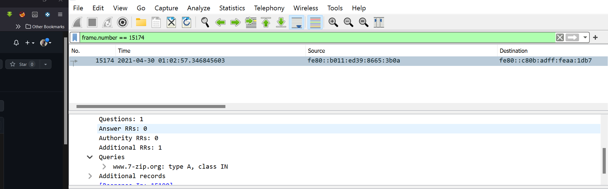

-----------------------------------------------------------------------------
**Q4** : How many UDP packets were sent from 192.168.1.26 to 24.39.217.246?

S4 : Filter packets by using (ip.src== 192.168.1.26 && ip.dst == 24.39.217.246 && udp) and then count packets will be (10 packets)

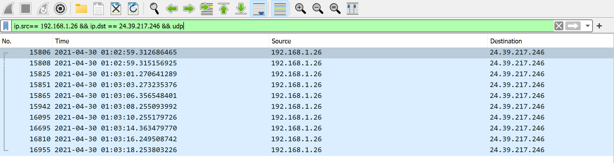

-----------------------------------------------------------------------------

**Q5** : What is the MAC address of the system being investigated in the PCAP?”

S5 : use ftp to filter packet and show mac address of source in Ethernet 

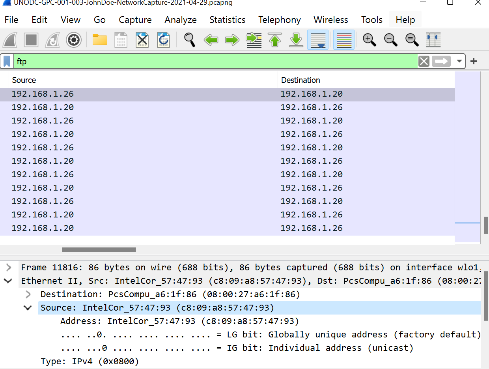

-----------------------------------------------------------------------------

**Q6** : What was the camera model name used to take picture 20210429_152157.jpg ?

S6 : write (ftp-data) to filter packets select first packet

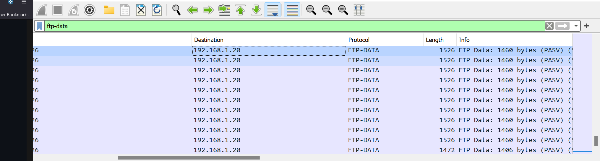

then use follow tcp stream and select Show data as and select (Raw)

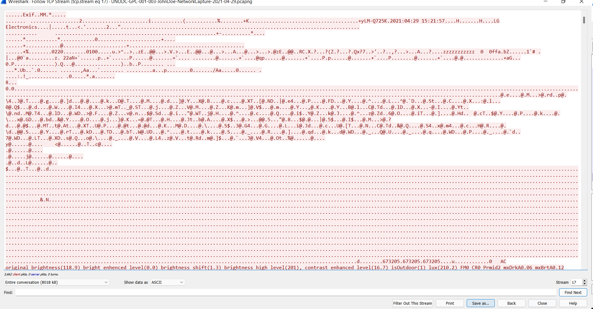

then click on save as and save data in JPG 

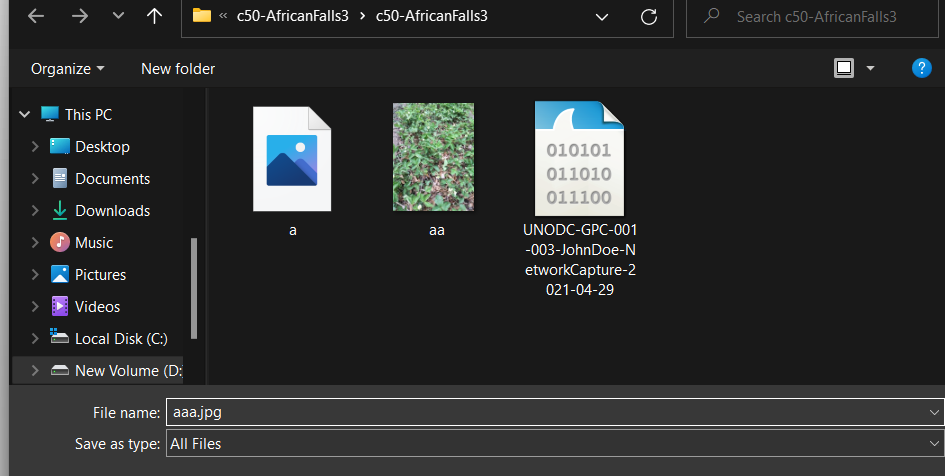

then click Right on pictures click in properties and seclect details then you show name of camera in camera model

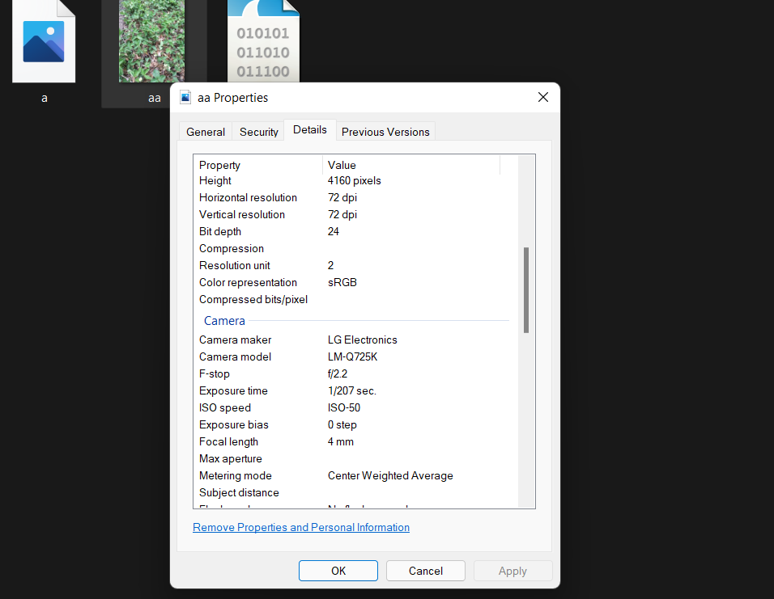

-----------------------------------------------------------------------------

**Q7** : What is the server certificate public key that was used in TLS session: da4a0000342e4b73459d7360b4bea971cc303ac18d29b99067e46d16cc07f4ff?

S7 : use this filter to get certificate (tls.handshake.session_id == da:4a:00:00:34:2e:4b:73:45:9d:73:60:b4:be:a9:71:cc:30:3a:c1:8d:29:b9:90:67:e4:6d:16:cc:07:f4:ff)

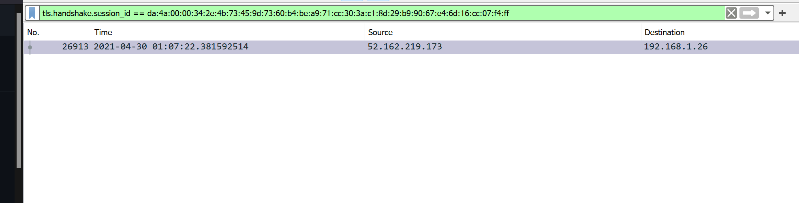

then you get pubkey in 

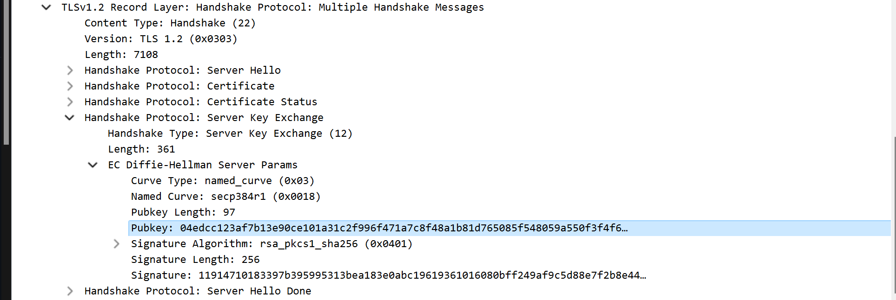

-----------------------------------------------------------------------------

**Q8** : What is the first TLS 1.3 client random that was used to establish a connection with protonmail.com?

S8 : Go to Statistics > Resolved Address then search for protonmail.com to get it's ip 

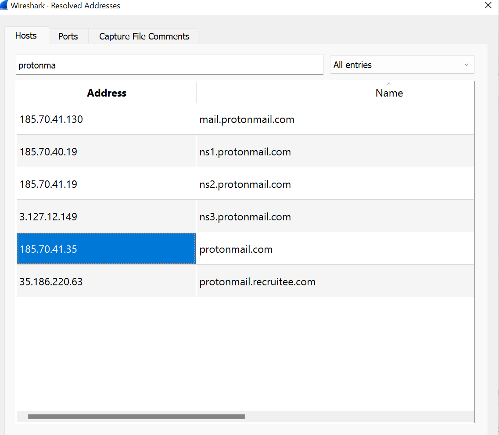

then write (ip.dst == 185.70.41.35 && tls) to filter packets and select first packet (hallo client) and then get random

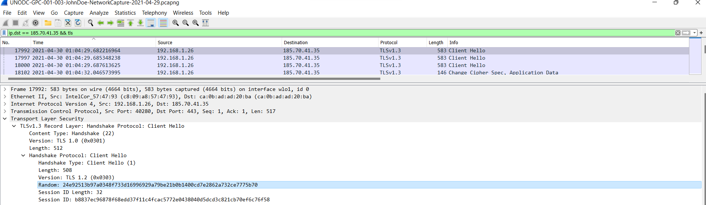

-----------------------------------------------------------------------------

**Q9** : What country is the MAC address of the FTP server registered in? (two words, one space in between)

S9 : write (ftp to filter packets and select packet and get mac of ftp server)

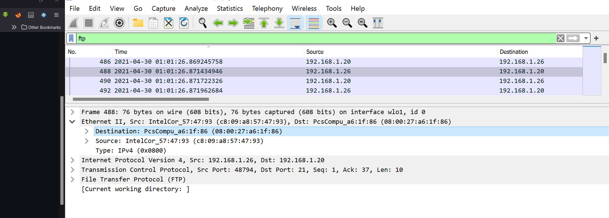

then use MAC address in this Website to get country (https://dnschecker.org/mac-lookup.php)

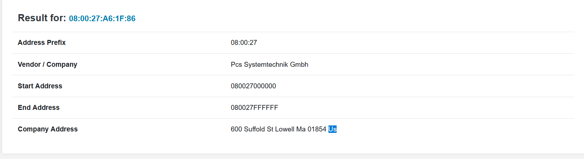

-------------------------------------------------------------------------------

**Q10** : What time was a non-standard folder created on the FTP server on the 20th of April? (hh:mm)

S10 : use (ftp-data) to filter packet and select first one right click on it the select follow tcp stream  

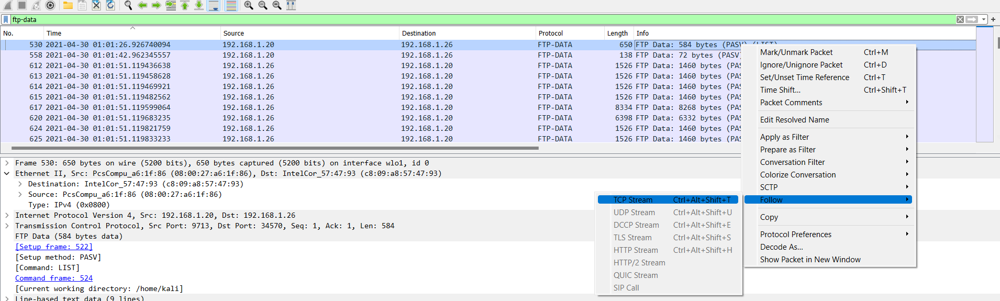

show folder created on 20th of april time is (17:53)

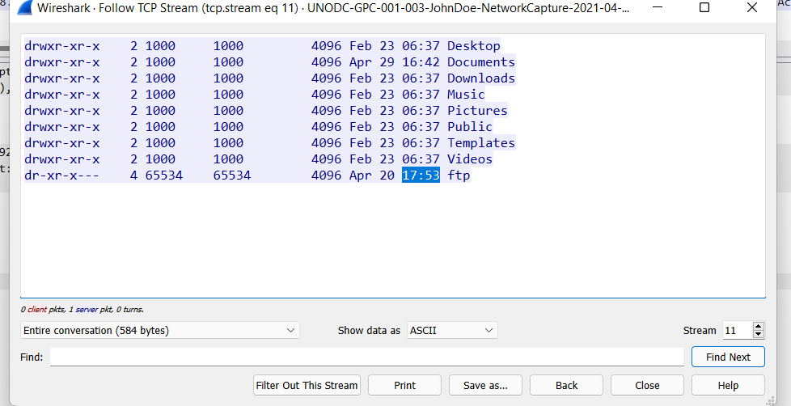

------------------------------------------------------------------------------------

**Q11** : What domain was the user connected to in packet 27300?

S11 : use (frame.number == 27300) then copy destination ip 

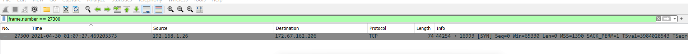

then go to statistics > resolved address 

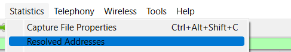

then write ip and then you get domain name

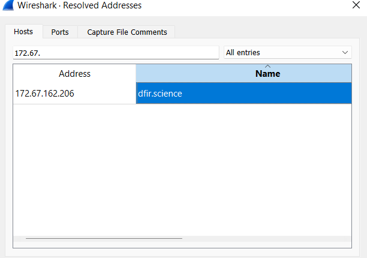

